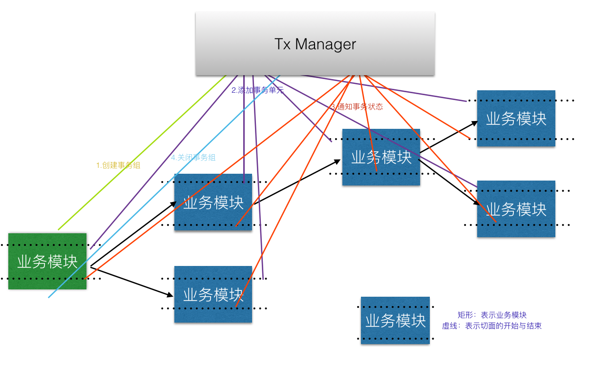

# txManager
分布式事务管理器

协调分布式事务的事务管理，并完成三阶段提交事务。

### 使用教程
1. 启动redis服务，并配置redis.properties配置文件。
2. 配置dubbo.properties配置文件。
3. 配置tx.properties配置文件。
4. 启动TxManager，可通过tomcat等web容器启动，也可以通过run: MainRunning.start()方法启动。

# 分布式事务设计原理

该框架分布式事务是基于spring事务框架基础之上做的再次封装，通过控制协调本地事务与全局事务的一致从而达到分布式事务控制的特别。该框架依赖Redis服务，将事务控制数据存放在redis下，因此在集群TxManager时只需要让其共享Redis服务即可。

## 三节段提交事务
1. 下达事务任务。
2. 确认事务模块状态。
3. 提交或回滚事务。

## 下达事务任务原理图

